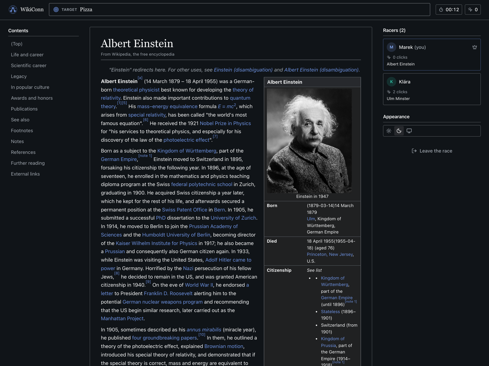
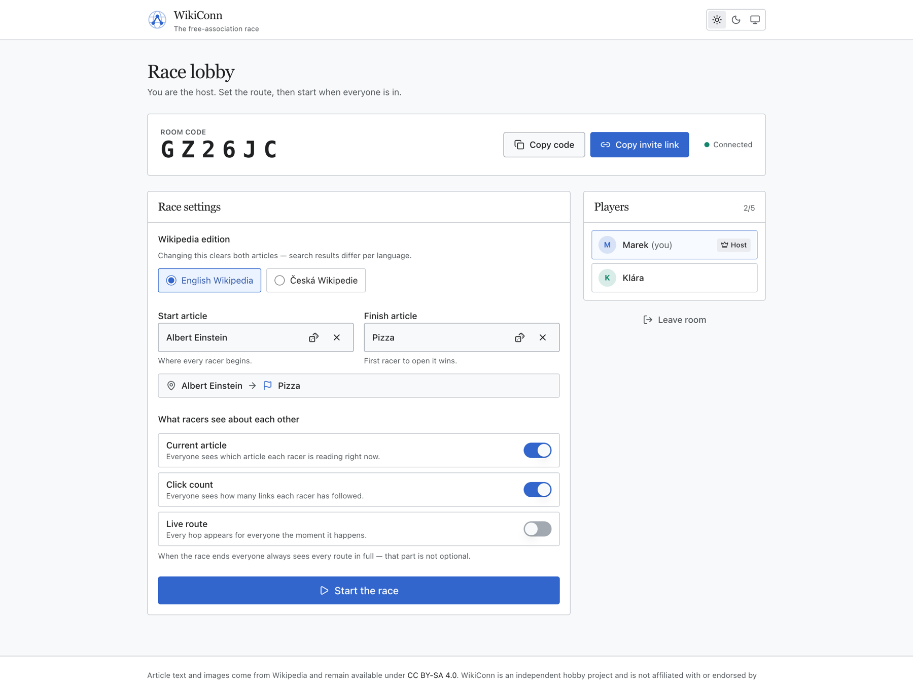

# WikiConn

Multiplayer Wikipedia race. Everyone starts on the same article and clicks
links to reach a target one. First to arrive wins. Two to five players per
room, no accounts.

Articles are fetched from Wikipedia, sanitized on the server and rendered in a
copy of the Vector 2022 skin, so the page you race through looks like the real
thing. Without the search box, obviously.





## Running it

Needs Node 24, pnpm 10 and Docker.

```bash
pnpm install
docker compose up -d                          # Dragonfly on :6380
cp apps/api/.env.example apps/api/.env
cp apps/web/.env.example apps/web/.env.local
pnpm dev                                      # web :3000, api :3001
```

Then open <http://localhost:3000>, create a room and open the invite link in a
second browser. Dragonfly is published on 6380 instead of 6379 so it does not
collide with a Redis you already have running.

## Scripts

| Command | Does |
| --- | --- |
| `pnpm dev` | both apps in watch mode |
| `pnpm build` | production builds |
| `pnpm test` | Vitest across every workspace |
| `pnpm check` | typecheck, lint, format check (the CI gate) |

## Layout

```
apps/api          NestJS: Wikipedia proxy, Socket.IO gateway, game rules
apps/web          Next.js App Router client
packages/shared   Zod schemas and the socket contract both ends compile against
```

State lives in Dragonfly: a hash per room, a hash of its players, and cached
article HTML. Rooms expire after 24 hours of silence.

## How a race works

The host picks a language, a start and a finish article, and how much players
see about each other while racing. On start, every client loads the start
article from `GET /wiki/:lang/:slug`. That HTML arrives with scripts, inline
handlers and external links stripped, and with internal links rewritten to
carry `data-wiki-slug`.

The client intercepts clicks on those links and emits `player:navigate`. The
server checks the target really is a link on the article the player is standing
on, records the move and broadcasts it, filtered by the host's visibility
settings. Reaching the finish ends the race for everyone, and the result screen
always reveals every player's full route regardless of those settings.

## Socket events

Defined and Zod-validated in `packages/shared/src/events.ts`. Every payload is
parsed on receipt, in both directions.

Client to server: `room:join`, `room:leave`, `room:update-settings`,
`room:start-game`, `player:navigate`, `game:reset`.

Server to client: `room:state`, `room:player-joined`, `room:player-left`,
`room:settings-updated`, `game:started`, `game:player-moved`, `game:won`,
`error`.

## Configuration

Both apps read their settings from env files; see `apps/api/.env.example` and
`apps/web/.env.example` for the full list and defaults.

## Deploying

Every merge to `main` runs the checks, builds both images, pushes them to GHCR
and rolls the stack on the server over SSH. That is all of
`.github/workflows/deploy.yml`; the server needs nothing but Docker.

Caddy terminates TLS and keeps everything on one origin: `/socket.io/*` and
`/api/*` go to the API, the rest to Next. Since `NEXT_PUBLIC_*` is baked into
the client bundle at build time, changing the domain means rebuilding the web
image rather than editing an env file — the workflow passes it as a build arg.

Repository secrets:

| Secret | What |
| --- | --- |
| `DEPLOY_HOST` | server hostname or IP |
| `DEPLOY_USER` | SSH user on that host |
| `DEPLOY_SSH_KEY` | private key for that user |
| `DEPLOY_KNOWN_HOSTS` | optional; pins the host key instead of trusting it on first connection |

Set the repository variable `WIKICONN_DOMAIN` to deploy somewhere other than
`wikiconn.mozola.net`.

## Licence

MIT, see [LICENSE](LICENSE).

Article text and images come from Wikipedia and remain under
[CC BY-SA 4.0](https://creativecommons.org/licenses/by-sa/4.0/); none of it is
redistributed in this repository. The design imitates the Vector 2022 skin, but
the name and logo belong to this project. WikiConn is not affiliated with the
Wikimedia Foundation.
